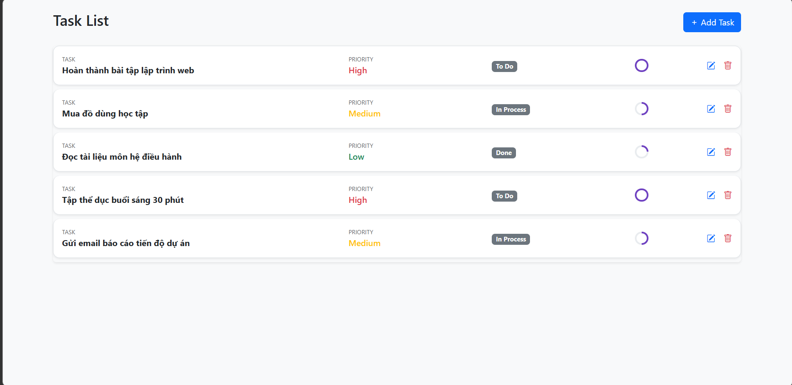
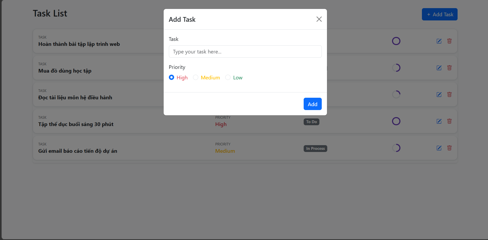
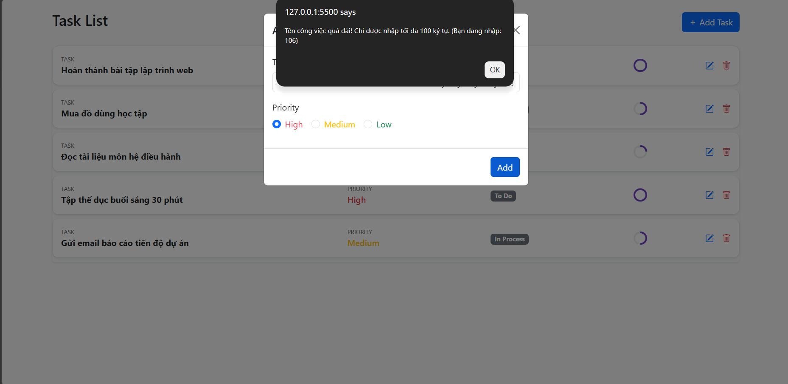

# Tasks List Application

## Giới thiệu

Tasks List là ứng dụng quản lý công việc được xây dựng trong môn Nền tảng Phát triển Web.

Dự án gồm hai phiên bản:

* HTML/CSS/JavaScript thuần
* ReactJS (Vite)

## Công nghệ sử dụng

### Frontend

* HTML5
* CSS3
* Bootstrap 5
* JavaScript ES6

### React Version

* ReactJS
* Vite

## Chức năng

### Hiển thị danh sách công việc

* Đọc dữ liệu từ file data.json
* Hiển thị danh sách task động

### Thêm công việc mới

* Người dùng có thể nhập tên task
* Task mới được thêm vào danh sách

### Kiểm tra dữ liệu

* Không cho phép bỏ trống tên task
* Tên task tối đa 100 ký tự
* Hiển thị thông báo lỗi khi dữ liệu không hợp lệ

## Cấu trúc thư mục

my-project
│
├── index.html
├── style.css
├── script.js
├── data.json
│
├── css
│   └── ...
│
├── js
│   └── ...
│
|-src
|   |___image1.png
|   |___image2.png
|   |___image3.png
|
| 
|
|
|
└── my-task-list-app
    │
    ├── README.md
    ├── package.json
    ├── package-lock.json
    ├── vite.config.js
    │
    ├── public
    │   └── ...
    │
    ├── src
    │   ├── App.jsx
    │   ├── main.jsx
    │   ├
    │   ├
    │   ├
    │   └── components
    │       └── ...
    │
    └── node_modules

## Hướng dẫn chạy phiên bản React

Cài đặt dependencies:

npm install

Khởi động ứng dụng:

npm run dev

Mở trình duyệt tại:

http://localhost:5173

## Hình ảnh minh họa

### Giao diện chính

### Thêm task mới

### Kiểm tra dữ liệu

## Tác giả

TA VIET HIEN

GitHub: https://github.com/lilmint12

Môn học: Nền tảng phát triển Web
